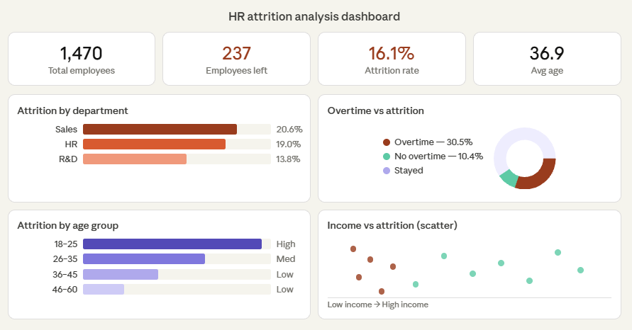

# HR Employee Attrition Analysis

## Project Overview
This project analyses the IBM HR Analytics dataset to identify the key factors driving employee attrition in an organisation. Using Python for data analysis and Tableau for visualisation, the project uncovers actionable insights that HR teams can use to reduce turnover and improve employee retention.

---

## Problem Statement
Employee attrition is costly — replacing a single employee can cost up to 2x their annual salary. This project answers the question: **Which employees are most at risk of leaving, and why?**

---

## Dataset
- **Source:** IBM HR Analytics Employee Attrition & Performance (Kaggle)
- **Size:** 1,470 employees | 35 features
- **Target variable:** `Attrition` (Yes / No)
- **Link:** https://www.kaggle.com/datasets/pavansubhasht/ibm-hr-analytics-attrition-dataset

---

## Tools & Technologies
| Tool | Purpose |
|------|---------|
| Python (Pandas, NumPy) | Data cleaning & wrangling |
| Matplotlib & Seaborn | Exploratory data analysis & charts |
| Scikit-learn | Random Forest feature importance |
| Tableau Public | Interactive dashboard |
| Jupyter Notebook | Project development environment |

---

## Project Structure
```
hr-attrition-analysis/
├── HR_Attrition_Analysis.ipynb   ← Main analysis notebook
├── WA_Fn-UseC_-HR-Employee-Attrition.csv  ← Raw dataset
├── hr_attrition_clean.csv        ← Cleaned data (for Tableau)
├── dashboard_screenshot.png      ← Dashboard preview
└── README.md
```

---

## Key Steps
1. **Data Understanding** — Shape, data types, missing values, class imbalance check
2. **Exploratory Data Analysis (EDA)** — Attrition by department, age group, salary, overtime, tenure
3. **Correlation Analysis** — Heatmap of numeric features vs attrition
4. **Feature Importance** — Random Forest classifier to rank top attrition drivers
5. **Dashboard** — Interactive Tableau dashboard for HR stakeholders

---

## Key Findings
- Employees who work **overtime are 3x more likely** to leave the company
- The **Sales department** has the highest attrition rate at 20.6%, vs 13.8% in R&D
- Employees in the **18–25 age group** show the highest attrition — early career instability
- **Low monthly income** (below ₹4,000/month) is strongly correlated with attrition
- Employees with **less than 2 years at the company** are at significantly higher risk
- **Job satisfaction and work-life balance** scores are key differentiators between stayers and leavers

---

## Business Recommendations
1. **Reduce mandatory overtime** — especially in Sales and HR departments where burnout is highest
2. **Introduce retention bonuses** for employees in their first 2 years
3. **Review salary bands** for junior roles — compensation below market rate drives early exits
4. **Improve onboarding** for younger employees (18–25) with mentorship programmes
5. **Monitor work-life balance scores** quarterly as an early warning signal

---

## Dashboard Preview
()

---

## How to Run
```bash
# Clone the repository
git clone https://github.com/YOUR-USERNAME/hr-attrition-analysis.git

# Install dependencies
pip install pandas numpy matplotlib seaborn scikit-learn

# Open the notebook
jupyter notebook HR_Attrition_Analysis.ipynb
```

---

## Author
**Monika Jaiswal**
- LinkedIn: www.linkedin.com/in/monika-jaisvval
- Naukri: naukri.com/your-profile
- Email: monikajaisvval@gmail.com
